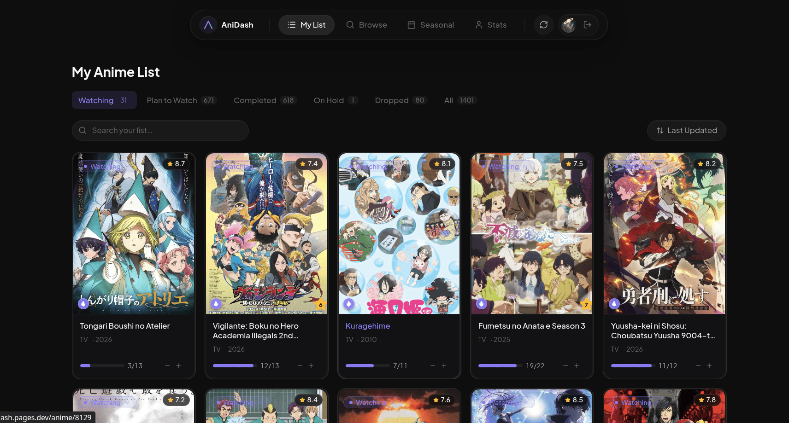

# AniDash ✨



AniDash is a premium, high-end personal anime tracker with a focus on **Ethereal Glass** aesthetics and high-performance list management. Powered by **Svelte 5 (Runes)**, **Tailwind CSS v4**, and the **MyAnimeList API**.

## ✨ Features

- **Ethereal Glass UI**: A custom-crafted design system using frosted glassmorphism, fluid animations, and high-contrast OLED black themes.
- **Offline-First Resilience**: Full IndexedDB caching for your entire watch list. Browse, check stats, and view anime details even without an internet connection.
- **Bi-Directional Sync**: Modern MAL API v2 integration with proper PKCE OAuth, real-time status updates, and permanent list deletion support.
- **MAL-Dubs Integration**: Instantly identify which anime have English dubs available using the MAL-Dubs dataset with a persistent 7-day TTL cache.
- **Advanced Recommendations**: Dual-source suggestions from both MyAnimeList and the Jikan community, unified into a premium suggested gallery.
- **Dynamic Stats & Sorting**: Comprehensive dashboard tracking your watching habits, episode distribution, and rating history with responsive visualizations. Enhanced data navigation with "MAL Rating" sorting for your personal list and seasonal anime.

## 🏗️ Architecture

AniDash is a unified SvelteKit application optimized for **Cloudflare Pages**.

1. **Frontend**: SvelteKit SPA using Svelte 5's fine-grained reactivity (Runes).
2. **Backend**: Serverless Edge Functions that handle secure MAL token exchange and CORS proxying.
3. **Database**: Client-side IndexedDB for lightning-fast performance and offline availability.

---

## 🛠 Setup & Development

### 1. Get MAL API Credentials

1. Go to [MyAnimeList API Settings](https://myanimelist.net/apiconfig).
2. Create a new ID.
   - **App Type**: `web`
   - **Redirect URI**: `http://localhost:5173/auth/callback` (for local development)

### 2. Environment Variables

Create a `.env` file in the root for the frontend:

```env
VITE_MAL_CLIENT_ID=your_mal_client_id
```

For local development of server-side routes, create a `.dev.vars` file in the root (used by Wrangler):

```env
MAL_CLIENT_ID=your_mal_client_id
MAL_CLIENT_SECRET=your_mal_client_secret
```

### 3. Running Locally

```sh
npm install
npm run dev
```

_The app will run on [http://localhost:5173](http://localhost:5173)._

---

## 🚀 Deployment (Cloudflare Pages)

AniDash is optimized for Cloudflare Pages.

### 1. Preparation

1. Ensure your MAL API Client settings include your production URL in the **Redirect URIs**:
   `https://your-app.pages.dev/auth/callback`

### 2. Cloudflare Pages Setup

1. Connect your repository to **Cloudflare Pages**.
2. **Build settings**:
   - **Framework preset**: `SvelteKit`
   - **Build command**: `npm run build`
   - **Build output directory**: `.svelte-kit/cloudflare`
3. **Environment Variables**:
   In the Cloudflare Dashboard, go to **Settings > Variables and Secrets** and add:

   | Variable             | Type                          | Description                                 |
   | -------------------- | ----------------------------- | ------------------------------------------- |
   | `VITE_MAL_CLIENT_ID` | Environment Variable          | Public Client ID for the frontend build.    |
   | `MAL_CLIENT_ID`      | Environment Variable / Secret | Client ID for backend proxying.             |
   | `MAL_CLIENT_SECRET`  | Secret                        | Your MAL Client Secret (Keep this private). |

4. **Compatibility Date**:
   Ensure the compatibility date is set to at least `2024-04-01` in the dashboard or `wrangler.toml`.

## License

This project is licensed under the [GNU General Public License v3.0](LICENSE).
